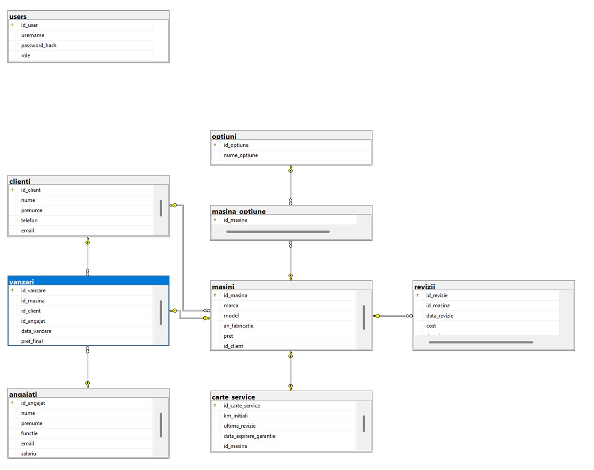

# 🏎️ AutoManager - Car Dealership Management System


## 🌟 Overview
**AutoManager** is a robust desktop application designed to simulate the operations of a modern car dealership. It provides a comprehensive solution for managing customers, vehicle inventory, employee records, service history, and sales transactions within a unified, secure environment.

The project emphasizes **Data Integrity**, **Object-Oriented Programming (OOP)** principles, and a clear separation of concerns using the **MVC (Model-View-Controller)** pattern.

---

## 🚀 Key Features
- **Comprehensive CRUD Operations**: Manage Clients, Vehicles, Employees, Services, and Sales.
- **Functional Interconnectivity**: Transactions link clients, cars, and employees seamlessly.
- **Service & Maintenance Tracking**: Digital service book for each vehicle with automated cost calculation and mileage validation.
- **Role-Based Access Control (RBAC)**: Distinct permissions for `ADMIN` and `EMPLOYEE` roles to ensure data security.
- **Relational Data Integrity**: Strict database constraints (Foreign Keys) prevent accidental deletion of critical transaction data.
- **Error Handling & User Feedback**: Graceful handling of SQL exceptions and intuitive UI messages.

---

## 🛠️ Tech Stack
| Component | Technology |
| :--- | :--- |
| **Language** | Java 17  |
| **GUI Framework** | JavaFX  |
| **Database** | Microsoft SQL Server  |
| **Data Access** | JDBC (Java Database Connectivity)  |
| **Build Tool** | Apache Maven  |
| **Architecture** | MVC Pattern with DAO (Data Access Object)  |

---

## 📊 Database Schema
The system relies on a normalized relational database with 9 interconnected entities:
- **Customers & Employees**: Personal and professional contact details.
- **Vehicles & Options**: Multi-vehicle management with N-N relationship for equipment options.
- **Service Books & Inspections**: Comprehensive history of technical interventions.
- **Sales**: Secure records of all successful dealership transactions.


---

## 🖼️ User Interface Showcase
*The application features a modular, tab-based interface for easy navigation between modules.*
### Main Dashboard & ERD



### Sales & Inventory Management


---

## ⚙️ Installation & Setup
### Prerequisites
- **JDK 17** or higher.
- **Apache Maven**.
- **Microsoft SQL Server**.

## 📄 Documentation
Detailed technical reports regarding the software architecture and database design can be found in the [docs](./docs/) folder:
- [Technical Report (Java/OOP)](./docs/Technical_Documentation.pdf)
- [Database Design & Normalization](./docs/Database_Design_Report.pdf)

### Database Initialization
1. Create a new database in SQL Server (e.g., `gestionare_reprezentanta_auto`).
2. Execute the provided SQL script found in the `/sql` directory to generate tables and constraints.

### Configuration
Update the `DBConnection.java` file with your SQL Server credentials:
```java
// Example JDBC Connection string
String url = "jdbc:sqlserver://localhost:1433;databaseName=gestionare_reprezentanta_auto;";


